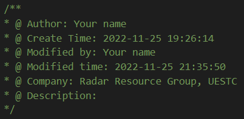

# Smart Comments

This is an extension that helps with annotations, making the code easier to read.

## Features

## Requirements
Dependencies:
`moment`
`path`

## Extension Settings

## Known Issues

## Release Notes

### v0.0.1

pre-release and informal version

## Following extension guidelines

press `Ctrl`-`Shift`-`I` to add file header.

## For more information

* [Smart Comments](https://github.com/hellocaoziyi/smart-comments.git)

**Enjoy!**
